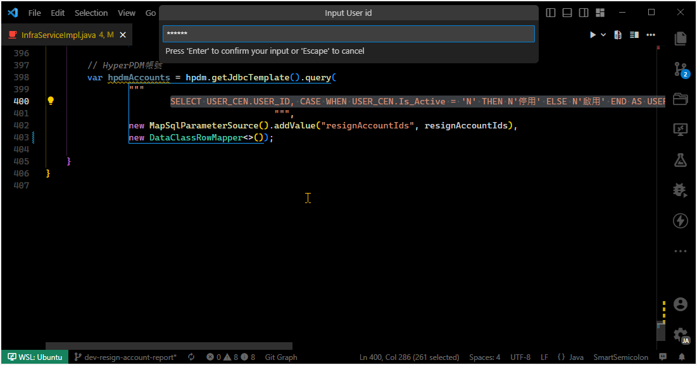

# SQLQuery JavaClass Converter
This VSCode extension can convert SQL query syntax into Java data class to store query results, reducing the manual process of creating classes.

## Features
 - Connection list (Needs to pre-configuration in **Extension Settings**)
 - Default template type/package name/class name (Needs to turn on in **Extension Settings**)
 - Automatically save the last converted template type/package name/class name (Needs to turn on in **Extension Settings**)

> You can bind custom shortcuts to `SQLQuery JavaClass Converter: Convert` command to enhance conversion efficiency.

## Requirements
- Java 8+
- MySQL 8+
- Oracle 10g+
- SQL Server 2014+
- SQLite 3+

> You need to install Java on your system and be able to execute `java -jar` command correctly.

## Extension Settings
* `sqlquery-javaclass-converter.connections`: The connection list of this extension.
* `sqlquery-javaclass-converter.connections.connectionName`: Connection name. _(required)_
* `sqlquery-javaclass-converter.connections.connectionDesc`: Connection description.
* `sqlquery-javaclass-converter.connections.jdbcUrl`: Connection's JDBC url. _(required)_
* `sqlquery-javaclass-converter.connections.userId`: Connection's user id. _(required)_
* `sqlquery-javaclass-converter.connections.password`: Connection's password.
* `sqlquery-javaclass-converter.connections.useSavedPassword`: Set to `true` to use saved password, set to `false` to prompt for a password for every connection.
* `sqlquery-javaclass-converter.defaultTemplateType`: **Default template type** for conversion.
* `sqlquery-javaclass-converter.useLastTemplateType`: Set to `true` to save the last input template type as **Default template type** for next conversion.
* `sqlquery-javaclass-converter.defaultPackageName`: **Default package name** for conversion.
* `sqlquery-javaclass-converter.useLastPackageName`: Set to `true` to save the last input package name as **Default package name** for next conversion.
* `sqlquery-javaclass-converter.defaultClassName`: **Default class name** for conversion.
* `sqlquery-javaclass-converter.useLastClassName`: Set to `true` to save the last input class name as **Default class name** for next conversion.
* `sqlquery-javaclass-converter.settingTarget`: Set to `User` to save current setting to Global settings, set to `Workspace` to save current setting to current Workspace settings.

## Instructions for use
Step1: The SQL query syntax has been written and now we will use this VSCode extension to create Java data class to load the query results. 

Step2: Selecting the entire SQL query syntax (parameters can also be included). 

Step3: Command Center -> Show and Run Commands -> Clicking on `SQLQuery JavaClass Converter: Convert`. 

Step4: Input JDBC url for database connection. 

Step5: Input User id. 

Step6: Input Password. 

Step7: Select a template to create Java data class. 

Step8: Input Package name. 

Step9: Input Class name. 

Step10: Wait for the conversion (approximately 3-5 seconds). 

Step11: Save the Java data class file when conversion finished. 

Step12: Input the Java data class as **mappedClass** of RowMapper. 

---

**Enjoy!**
